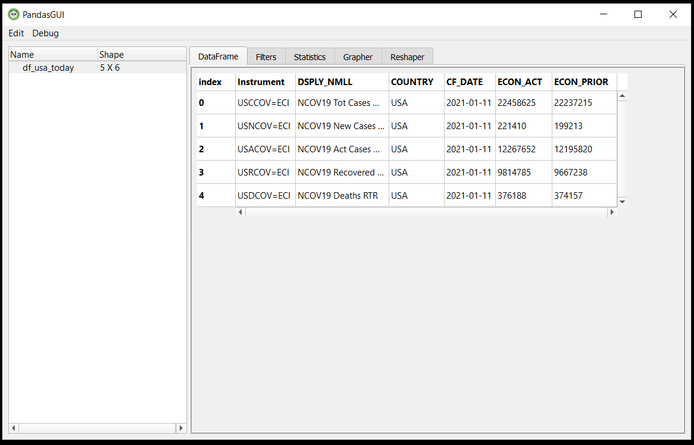
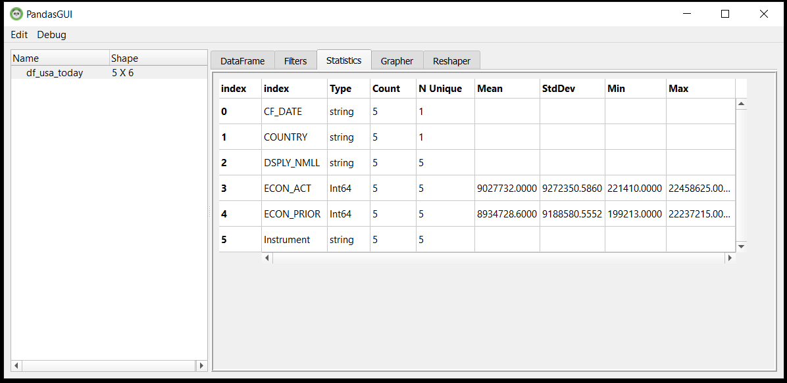
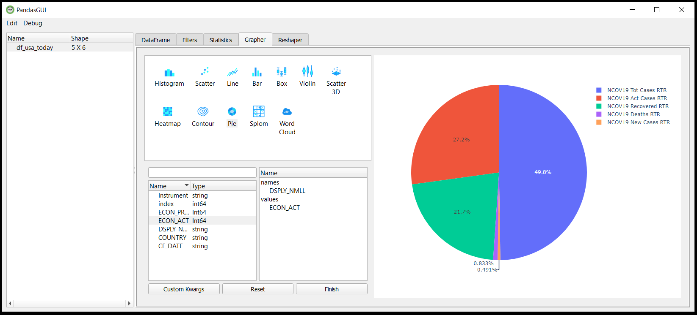
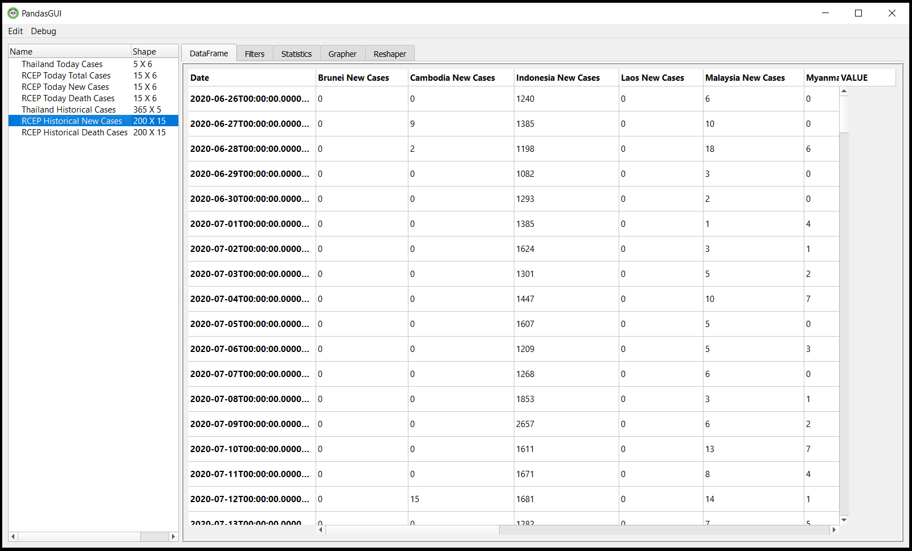
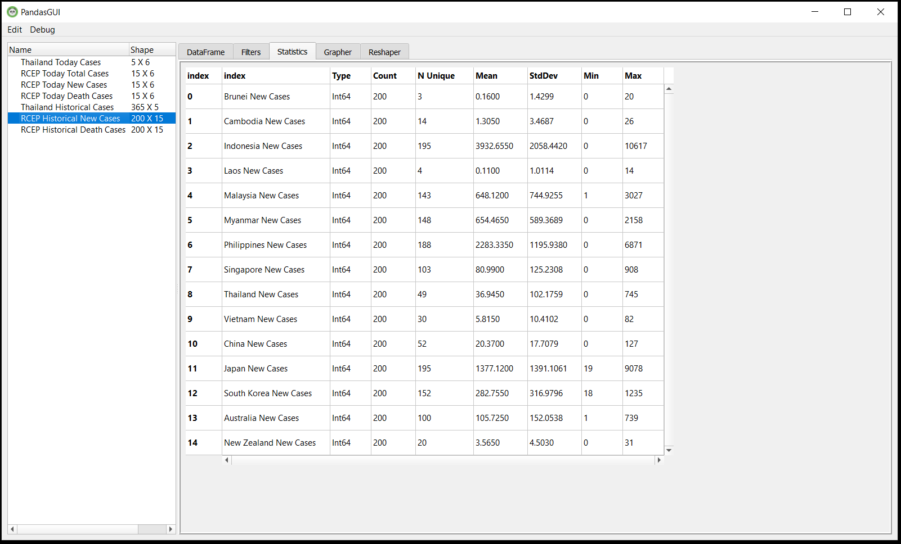
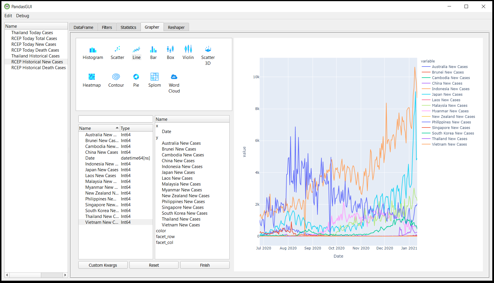

# Using PandasGUI to analyze Pandas DataFrames with GUI
- Last update: January 2021
- Environment: Windows 
- Compiler: Python and Conda distribution
- Prerequisite: Refinitiv Eikon or Refinitiv Workspace application with access to Eikon Data APIs.

## <a id="overview"></a>Overview

With the rise of Data Scientists, Financial coders, or Traders (aka Citizen Developers), the [Pandas library](https://pandas.pydata.org/) has become the defacto tool for data analysis with [Python programming language](https://www.python.org/). Pandas is powerful, flexible, has excellent community support, and it keeps improving. However, developers require a great skill of Python and the library to using Pandas efficiently. This learning curve makes some developers and data scientists stuck with the "coding" time instead of "analysis" time.

he [PandasGUI](https://github.com/adamerose/PandasGUI) is the Graphical User Interface tool that can solve this learning curve issue. The tool wraps Pandas functions into an easy to use data analytic tool for developers and data scientists to start with. This example project shows how to use PandasGUI] too for the basic data analysis with the simple GUI interface. The demo application uses Corona Virus Disease (COVID-19) from [Eikon Data API](https://developers.refinitiv.com/en/api-catalog/eikon/eikon-data-api) as an example of a dataset.

*Note*:
The PandasGUI tool is still under development. The tool **is not compatible** with Eikon Data API and [Refinitiv Data Platform (RDP) Libraries](https://developers.refinitiv.com/en/api-catalog/refinitiv-data-platform/refinitiv-data-platform-libraries) - Python on IPython/Notebook environment yet. This example project is focusing on the console environment only.

## <a id="pandasgu_intro"></a>Introduction to PandasGUI

[PandasGUI](https://github.com/adamerose/pandasgui) is a GUI tool for analyzing Pandas DataFrames. The tool is developed by [@adamerose](https://github.com/adamerose). The tool comes with the built-in Pandas function that lets data scientists explore the DataFrame object, DataFrame manipulation, filter data, reframing DataFrame object, and also plotting a simple graph for visualization.  

[](https://www.youtube.com/watch?v=NKXdolMxW2Y "PandasGUI Demo")

*Note*:
- This project is based on PandasGUI versions **0.2.7**.

## <a id="eikon_intro"></a>Introduction to Eikon Data API

The  [Eikon Data API](https://developers.refinitiv.com/en/api-catalog/eikon/eikon-data-api) (aka DAPI) provides access to certain Refinitiv Eikon/Refinitiv Workspace data with seamless workflow with the same data across all applications running on the desktop. The API allows developers to tap into the full breadth of community tools through a modern API with native Python support.

 

*Note*:
- This project is based on Eikon Data API versions **1.1.8**.
- Pleases see [Eikon Data API Usage and Limits Guideline](https://developers.refinitiv.com/en/api-catalog/eikon/eikon-data-api/documentation#eikon-data-api-usage-and-limits-guideline) regarding the API data coverage and data limit. 

## <a id="prerequisite"></a>Prerequisite
This example requires the following dependencies software and libraries.
1. Refinitiv Eikon or Refinitiv Workspace application with access to Eikon Data APIs.
2. Python [Ananconda](https://www.anaconda.com/distribution/) or [MiniConda](https://docs.conda.io/en/latest/miniconda.html) distribution/package manager.
3. Internet connection.

*Note:* 
- This Project has been qualified with Python version 3.7.9 and Conda version 4.8.3

Please contact your Refinitiv's representative to help you to access Refinitiv Workspace/Eikon credentials. You can generate/manage the AppKey from the  [AppKeyGenerator web site](https://emea1.apps.cp.thomsonreuters.com/apps/AppkeyGenerator) or AppKey Generator tool in Eikon Desktop/Refinitiv Workspace application. 

## <a id="application_files"></a>Application Files
This example project contains the following files and folders
1. *src/simple_covid_19_app.py*: The example console application file that demonstrates  USA COVID-19 data with PandasGUI.
2. *src/rcep_covid19_data_app.py*: The example console application file that demonstrates  RCEP (Regional Comprehensive Economic Partnership) countries COVID-19 data with PandasGUI.
3. *requirements.txt*: The project dependencies configuration file.
4. *images*: Project images folder.
5. *LICENSE.md*: Project's license file.
6. *README.md*: Project's README file.

## <a id="eikon_setup"></a>Eikon Data API Setup

Please follow a step by step guide to setup your Eikon Data API and your AppKey in [Eikon Data API Quick Start page](https://developers.refinitiv.com/en/api-catalog/eikon/eikon-data-api/quick-start). 

Please note that you can also create your Appkey via <a href="https://amers1.apps.cp.thomsonreuters.com/apps/AppkeyGenerator">AppKey Generator web site</a>.

## <a id="running"></a>How to run this example

Please note that the Refinitiv Workspace/Eikon application integrates a Data API proxy that acts as an interface between the Eikon Data API Python library and the Eikon Data Platform. For this reason, the Refinitiv Workspace/Eikon application must be running when you use the Eikon Data API Python library.

The first step is to unzip or download the example project folder into a directory of your choice, then set up a Conda environment for running the application with the steps below.

1. Open Anaconda Prompt and go to the project's folder
2. Run the following command in the Anaconda Prompt application to create a Conda environment named *pandasgui* for the project.
    ```
    (base) $>conda env create --name pandasgui python=3.7
    ```
3. Once the environment is created, activate Conda environment named ```pandasgui``` with this command in Anaconda Prompt.
    ```
    (base) $>conda activate pandasgui
    ```
4. Run the following command to install Eikon Data API, PandasGUI, and all dependencies in *pandasgui* environment.
    ```
    (pandasgui) $>pip install -r requirements.txt
    ```
4. Go to the project's src folder. and create a file name ```credential.cfg``` with the following content.
    ```
    [workspace]
    app_id = YOUR_APP_ID_HERE
    ```
5. Open and log in Refinitiv Workspace/Eikon application with your Workspace/Eikon credential.
6. In the current Anaconda Prompt, stay in project's src folder. Run the following command to run example applications.
    ```
    (pandasgui) $>src>python simple_covid_19_app.py
    ```

    ```
    (pandasgui) $>src>python rcep_covid19_data_app.py
    ```

## <a id="results"></a>Example Results

*simple_covid_19_app.py:*

 

 

 

*rcep_covid19_data_app.py:*

 

 

 

## <a id="summary"></a>Conclusion

PandasGUI tool provides a simple GUI interface that helps Data Scientists analyze data without requiring a great Python/Pandas programming skill. Data Scientists can just get the data and use the tool for data exploratory, creating simple visualize data, or exporting data to a CSV file. The PandasGUI tool lets everybody access Pandas built-in functions via the GUI which is suitable for a wide range of programming skills. The casual developers/data scientists can use PandasGUI as a starting tool for data analysis while the professional developers can use this tool for quick data checking. Please note that PandasGUI is under active development, we might see some more features in the coming days.

At the same time, the [Eikon Data API](https://developers.refinitiv.com/en/api-catalog/eikon/eikon-data-api) lets developers rapidly access Refinitiv Eikon/Refinitiv Workspace data and our latest platform capabilities with a few lines of code that easy to understand and maintain. 

## <a id="references"></a>References

You can find more detail regarding the PandasGUI, Eikon Data APIs, and related technologies from the following resources:
* [Refinitiv Eikon Data API page](https://developers.refinitiv.com/en/api-catalog/eikon/eikon-data-api) on the [Refinitiv Developer Community](https://developers.refinitiv.com/) web site.
* [PandasGUI GitHub page](https://github.com/adamerose/PandasGUI).
* [PandasGUI PyPi page](https://pypi.org/project/pandasgui/).
* [PandasGUI: GUI interface for Pandas Library](https://dev.to/gagande90/pandasgui-an-gui-interface-for-pandas-library-bp6)
* [PandasGUI: Analyzing Pandas DataFrame with a Graphical User Interface](https://towardsdatascience.com/pandasgui-analyzing-pandas-dataframes-with-a-graphical-user-interface-36f5c1357b1d)
* [Eikon Data API Quick Start Guide page](https://developers.refinitiv.com/en/api-catalog/eikon/eikon-data-api/quick-start).
* [Eikon Data API Tutorial page](https://developers.refinitiv.com/en/api-catalog/eikon/eikon-data-api/tutorials).
* [Python Quants Video Tutorial Series for Eikon API](https://community.developers.refinitiv.com/questions/37865/announcement-new-python-quants-video-tutorial-seri.html).
* [Eikon Data APY Python Reference Guide](https://developers.refinitiv.com/en/api-catalog/eikon/eikon-data-api/documentation#eikon-data-ap-is-for-python-reference-guide).
* [Eikon Data API Troubleshooting article](https://developers.refinitiv.com/en/article-catalog/article/eikon-data-api-python-troubleshooting-refinitiv).
* [Get Coronavirus Cases Latest And Timeseries Statistic with Eikon Data API(Python) article](https://github.com/Refinitiv-API-Samples/Article.EikonAPI.Python.CoronavirusStatistic)

For any question related to this example or Eikon Data API, please use the Developers Community [Q&A Forum](https://community.developers.refinitiv.com/spaces/92/eikon-scripting-apis.html).
